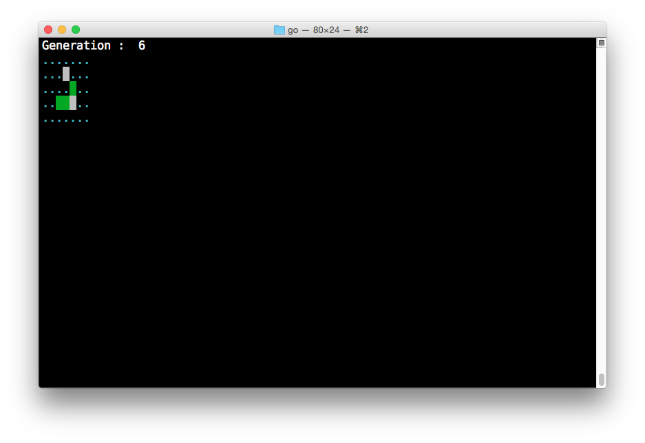

# Game of Life

A Go version of the Game of Life.

See https://en.wikipedia.org/wiki/Game_of_Life

## Rules

1. Any live cell with fewer than two live neighbours dies, as if caused by
   under-population.
1. Any live cell with two or three live neighbours lives on to the next
   generation.
1. Any live cell with more than three live neighbours dies, as if by
   overcrowding.
1. Any dead cell with exactly three live neighbours becomes a live cell, as if
   by reproduction.

## Install

    go get github.com/scottjbarr/gameoflife-go

## Run

Pass the `-h` switch to see `help`

    go run main.go loader.go -file ./docs/glider.L

## Test

    go test github.com/scottjbarr/gameoflife-go

or from the project directory

    go test

## License

The MIT License (MIT)

Copyright (c) 2015 Scott Barr

See [LICENSE.md](LICENSE.md)
